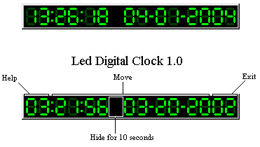



## \[   Digital Clock v1\.0   \]

### Description

Small nice Digital Clock that remembers its last position
 
### More Info
 

             |
---                |---
**Submitted On**   |2005-04-28 16:30:04
**By**             |[Michael Margold](https://github.com/Planet-Source-Code/PSCIndex/blob/master/ByAuthor/michael-margold.md)
**Level**          |Advanced
**User Rating**    |4.3 (47 globes from 11 users)
**Compatibility**  |VB 6\.0
**Category**       |[Complete Applications](https://github.com/Planet-Source-Code/PSCIndex/blob/master/ByCategory/complete-applications__1-27.md)
**World**          |[Visual Basic](https://github.com/Planet-Source-Code/PSCIndex/blob/master/ByWorld/visual-basic.md)
**Archive File**   |[\[\_\_\_Digita188318512005\.zip](https://github.com/Planet-Source-Code/michael-margold-digital-clock-v1-0__1-52788/archive/master.zip)

